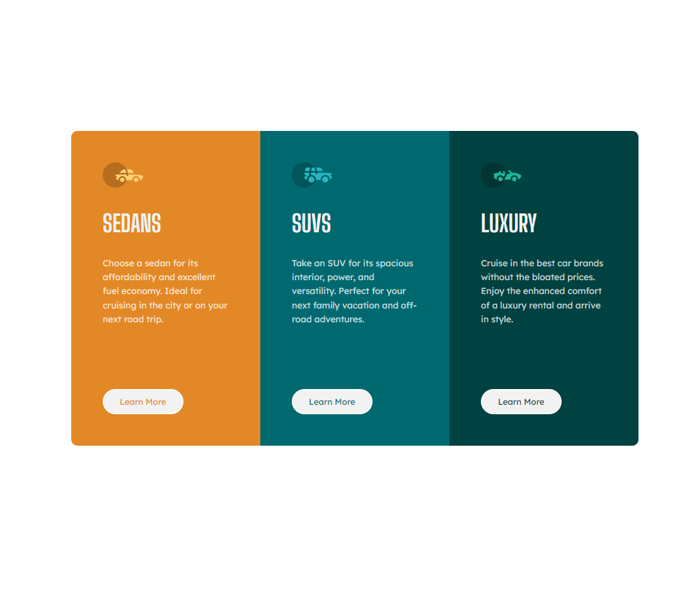

# Frontend Mentor - 3-column preview card component solution

This is a solution to the [3-column preview card component challenge on Frontend Mentor](https://www.frontendmentor.io/challenges/3column-preview-card-component-pH92eAR2-). Frontend Mentor challenges help you improve your coding skills by building realistic projects. 

## Table of contents

- [Overview](#overview)
  - [Screenshot](#screenshot)
  - [Links](#links)
- [My process](#my-process)
  - [Built with](#built-with)
  - [What I learned](#what-i-learned)
  - [Continued development](#continued-development)
  - [Useful resources](#useful-resources)
- [Author](#author)
- [Acknowledgments](#acknowledgments)

## Overview

### Screenshot

### Links

- Live Site URL: [Github Pages](https://alexurielcontreras.github.io/fem-3card-componet/)

## My process

### Built with

- Semantic HTML5 markup
- CSS custom properties
- Flexbox
- Sass

### What I learned
  
  I used this challenge to learn Sass and for some more Flexbox practice. 
  Sass made writing CSS faster and quicker. I really enjoyed using mixins so I can apply many styles to different element while folloing DRY

### Useful resources

- [Learn Sass](https://sass-lang.com/guide) - Sass Document

## Author

- Website - [Coming Soon...](https://www.linkedin.com/in/alex-contreras-788b55225/)
- Frontend Mentor - [@AlexContreras](https://www.frontendmentor.io/profile/AlexUrielContreras)
- Twitter - [@AUC829](https://twitter.com/AUC829)

